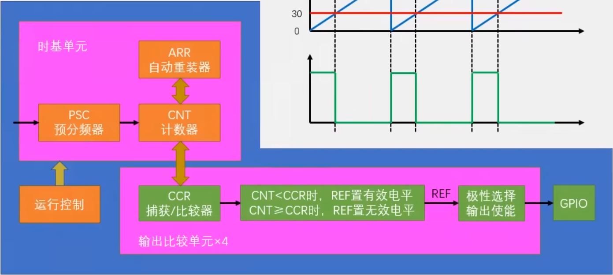

OC即输出比较，IC为输入捕获，CC为compare\capture
OC有8中模式：

其中常用的为PWM1模式

参数计算公式为：
$$
PWM分辨率=\frac{1}{ARR+1}
$$

$$
PWM占空比=\frac{CCR}{ARR+1}
$$

$$
PWM频率=\frac{72MHz}{(ARR+1)(PSC+1)}
$$

OC用到的函数有：

```
//TIM有4个输出比较单元，每个输出比较单元对应的输出接口不同，可以看AFIO复用部分的接口定义
void TIM_OC1Init(TIM_TypeDef* TIMx, TIM_OCInitTypeDef* TIM_OCInitStruct);
void TIM_OC2Init(TIM_TypeDef* TIMx, TIM_OCInitTypeDef* TIM_OCInitStruct);
void TIM_OC3Init(TIM_TypeDef* TIMx, TIM_OCInitTypeDef* TIM_OCInitStruct);
void TIM_OC4Init(TIM_TypeDef* TIMx, TIM_OCInitTypeDef* TIM_OCInitStruct);

//强制模式
void TIM_ForcedOC1Config(TIM_TypeDef* TIMx, uint16_t TIM_ForcedAction);
void TIM_ForcedOC2Config(TIM_TypeDef* TIMx, uint16_t TIM_ForcedAction);
void TIM_ForcedOC3Config(TIM_TypeDef* TIMx, uint16_t TIM_ForcedAction);
void TIM_ForcedOC4Config(TIM_TypeDef* TIMx, uint16_t TIM_ForcedAction);

//影子寄存器配置
void TIM_OC1PreloadConfig(TIM_TypeDef* TIMx, uint16_t TIM_OCPreload);
void TIM_OC2PreloadConfig(TIM_TypeDef* TIMx, uint16_t TIM_OCPreload);
void TIM_OC3PreloadConfig(TIM_TypeDef* TIMx, uint16_t TIM_OCPreload);
void TIM_OC4PreloadConfig(TIM_TypeDef* TIMx, uint16_t TIM_OCPreload);

//不用了解😀
void TIM_OC1FastConfig(TIM_TypeDef* TIMx, uint16_t TIM_OCFast);
void TIM_OC2FastConfig(TIM_TypeDef* TIMx, uint16_t TIM_OCFast);
void TIM_OC3FastConfig(TIM_TypeDef* TIMx, uint16_t TIM_OCFast);
void TIM_OC4FastConfig(TIM_TypeDef* TIMx, uint16_t TIM_OCFast);
void TIM_ClearOC1Ref(TIM_TypeDef* TIMx, uint16_t TIM_OCClear);
void TIM_ClearOC2Ref(TIM_TypeDef* TIMx, uint16_t TIM_OCClear);
void TIM_ClearOC3Ref(TIM_TypeDef* TIMx, uint16_t TIM_OCClear);
void TIM_ClearOC4Ref(TIM_TypeDef* TIMx, uint16_t TIM_OCClear);

//设置输出的极性，可以反相输出
void TIM_OC1PolarityConfig(TIM_TypeDef* TIMx, uint16_t TIM_OCPolarity);
void TIM_OC1NPolarityConfig(TIM_TypeDef* TIMx, uint16_t TIM_OCNPolarity);
void TIM_OC2PolarityConfig(TIM_TypeDef* TIMx, uint16_t TIM_OCPolarity);
void TIM_OC2NPolarityConfig(TIM_TypeDef* TIMx, uint16_t TIM_OCNPolarity);
void TIM_OC3PolarityConfig(TIM_TypeDef* TIMx, uint16_t TIM_OCPolarity);
void TIM_OC3NPolarityConfig(TIM_TypeDef* TIMx, uint16_t TIM_OCNPolarity);
void TIM_OC4PolarityConfig(TIM_TypeDef* TIMx, uint16_t TIM_OCPolarity);

//设置CCR中的值，比较重要
void TIM_SetCompare1(TIM_TypeDef* TIMx, uint16_t Compare1);
void TIM_SetCompare2(TIM_TypeDef* TIMx, uint16_t Compare2);
void TIM_SetCompare3(TIM_TypeDef* TIMx, uint16_t Compare3);
void TIM_SetCompare4(TIM_TypeDef* TIMx, uint16_t Compare4);
```

初始化过程流程图为：


初始化函数为：
```
void TIM_OCinit(){
    RCC_APB1PeriphClockCmd(RCC_APB1Periph_TIM2,ENABLE);
    RCC_APB2PeriphClockCmd(RCC_APB2Periph_GPIOA,ENABLE);

    GPIO_InitTypeDef GPIO_structure;
    GPIO_structure.GPIO_Mode=GPIO_Mode_AF_PP;
    GPIO_structure.GPIO_Pin=GPIO_Pin_0;
    GPIO_structure.GPIO_Speed=GPIO_Speed_2MHz;
    GPIO_Init(GPIOA,&GPIO_structure);

    TIM_InternalClockConfig(TIM2);

    TIM_TimeBaseInitTypeDef TIM_BASEstructure;
    TIM_BASEstructure.TIM_ClockDivision=TIM_CKD_DIV1;
    TIM_BASEstructure.TIM_CounterMode=TIM_CounterMode_Up;
    TIM_BASEstructure.TIM_Period=99;        //ARR
    TIM_BASEstructure.TIM_Prescaler=720-1;  //PSC
    TIM_BASEstructure.TIM_RepetitionCounter=0;

    TIM_TimeBaseInit(TIM2,&TIM_BASEstructure);

    TIM_OCInitTypeDef TIM_OCstructure;
    TIM_OCStructInit(&TIM_OCstructure);
    TIM_OCstructure.TIM_OCMode=TIM_OCMode_PWM1;
    TIM_OCstructure.TIM_OCPolarity=TIM_OCPolarity_High;
    TIM_OCstructure.TIM_OutputState=TIM_OutputState_Enable;
    TIM_OCstructure.TIM_Pulse=50;           //CCR
    TIM_OC1Init(TIM2,&TIM_OCstructure);

    TIM_Cmd(TIM2,ENABLE);

}
```


要使用AFIO的引脚重映射功能需要使用：
void GPIO_PinRemapConfig(uint32_t GPIO_Remap, FunctionalState NewState);
同时需要注意复用的引脚是否正在执行其他功能。具体引脚复用的对应需要看手册。
代码为：
```
RCC_APB2PeriphClockCmd(RCC_APB2Periph_AFIO,ENABLE);
GPIO_PinRemapConfig(GPIO_PartialRemap1_TIM2,ENABLE);
GPIO_PinRemapConfig(GPIO_Remap_SWJ_JTAGDisable,ENABLE);
```
